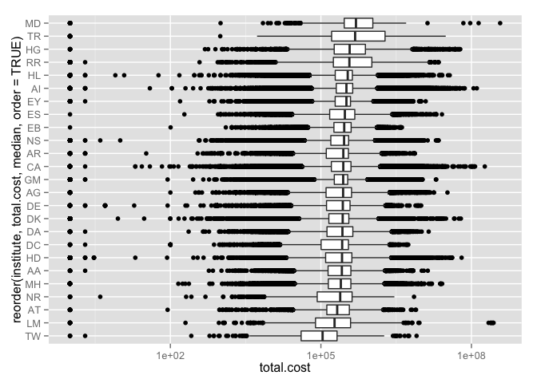

Overview
========

The `nihexporter` package provides a minimal set of data from NIH
EXPORTER <http://exporter.nih.gov/default.aspx>, which contains
information on NIH biomedical research funding from 1985-2014 (and
continues monthly in a given fiscal year).

The package contains the following tables:

-   `projects`: provides data on funded projects by NIH.

-   `publinks`: links Pubmed IDs (`pmid`) to project numbers
    (`project.num`)

Data summary
------------

There is a lot of data in NIH EXPORTER, so this package aims to provide
a minimal set of data without being too unwieldy. There are download and
import (`tidy_projects.R`) scripts in the `data-raw/` directory in the
package.

In the future, we might offer `project.pis` and `project.org` tables, to
see the who and where of NIH investment. See \#1.

Install
-------

Install the `nihexporter` package from github with:

    devtools::install_github("jayhesselberth/nihexporter")

Examples
========

    library(dplyr)
    library(knitr)
    library(ggplot2)
    library(nihexporter)

List the all-time most expensive grants from each institute:

    expensive.projects <- projects %>%
      select(project.num, institute, total.cost, project.start, project.end) %>%
      group_by(project.num, institute) %>%
      summarise(overall.cost = sum(total.cost, na.rm = TRUE)) %>%
      ungroup() %>%
      group_by(institute) %>%
      arrange(desc(overall.cost)) %>%
      slice(1:1) %>%
      ungroup() %>%
      arrange(desc(overall.cost)) %>%
      mutate(cost.in.billions = overall.cost / 1e9)

    head(expensive.projects)

    ## Source: local data frame [6 x 4]
    ## 
    ##   project.num institute overall.cost cost.in.billions
    ## 1 ZIHLM200888        LM   1544981304        1.5449813
    ## 2 ZIFBC000001        CA    652060692        0.6520607
    ## 3 U54HG003067        HG    527942706        0.5279427
    ## 4 ZIFAI000001        AI    389496063        0.3894961
    ## 5 ZIIMD000005        MD    373377914        0.3733779
    ## 6 U62PS223540        PS    298137847        0.2981378

Let's look at the amounts spent on grants at each institute since fiscal
year 2000:

    grant.spending <- projects %>% 
      filter(fiscal.year >= 2000) %>%
      select(institute, total.cost) %>%
      filter(total.cost > 0)

    grant.spending %>%
      ggplot(aes(factor(institute), total.cost)) +
      geom_boxplot() +
      scale_y_log10() +
      coord_flip()

See the [vignette](vignettes/nihexporter.Rmd) for more examples.
