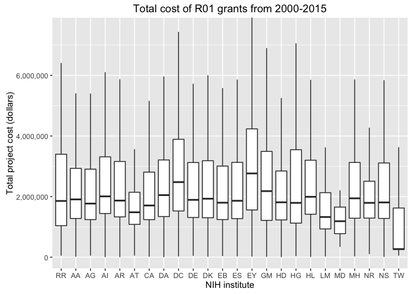

[](https://travis-ci.org/jayhesselberth/nihexporter)

nihexporter
===========

The `nihexporter` package provides a minimal set of data from [NIH EXPORTER](http://exporter.nih.gov/default.aspx), which contains information on NIH biomedical research funding from 1985-2014 (and continues monthly in a given fiscal year).

Information about specific columns in the tables is [here](http://exporter.nih.gov/about.aspx).

The package contains the following tables:

-   `projects`: provides data on funded projects by NIH.

-   `project_pis`: links project numbers (`project.num`) to PI ID (`pi.id`), which can used in NIH REPORTER searches

-   `project_orgs`: links DUNS numbers (`org.duns`) from `projects` table to information on specific organizations

-   `publinks`: links Pubmed IDs (`pmid`) to project numbers (`project.num`)

-   `patents`: links project IDs (`project.num`) to `patent.id`

-   `project_io`: pre-computed `n.pubs`, `n.patents` and `project.cost` for each `project.num`

There are also a few helper variables that make exploratory analysis a bit easier:

-   `nih.institutes`: 27 NIH institutes in two-letter format

Data summary
------------

There is a lot of data in NIH EXPORTER, so this package aims to provide a minimal set of data without being too unwieldy. There are download and import scripts in the `data-raw/` directory in the package.

Because `total.cost` is only available from fiscal year 2000 and onward, only data from those years is provided in the `projects` table. The `publinks` table goes back to 1985.

Install
-------

Install the `nihexporter` package from github with:

    devtools::install_github("jayhesselberth/nihexporter")

Examples
--------

List the all-time most expensive grants from each institute:

``` r
expensive_projects <- projects %>%
  select(project.num, institute) %>%
  group_by(project.num, institute) %>%
  left_join(project_io) %>%
  ungroup() %>%
  group_by(institute) %>%
  arrange(desc(total.cost)) %>%
  slice(1:1) %>%
  ungroup() %>%
  arrange(desc(total.cost)) %>%
  mutate(cost.in.billions = total.cost / 1e9)
#> Joining, by = "project.num"
#> Warning in left_join_impl(x, y, by$x, by$y, suffix$x, suffix$y): joining
#> character vector and factor, coercing into character vector

head(expensive_projects)
#> Source: local data frame [6 x 6]
#> 
#>   project.num institute n.pubs n.patents total.cost cost.in.billions
#>         <chr>    <fctr>  <int>     <int>      <dbl>            <dbl>
#> 1 ZIHLM200888        LM    126         1 1544981304        1.5449813
#> 2 ZIFBC000001        CA      1         1  652060692        0.6520607
#> 3 U54HG003067        HG    139         1  527942706        0.5279427
#> 4 ZIFAI000001        AI      1         1  389496063        0.3894961
#> 5 U01AG009740        AG    432         1  219008592        0.2190086
#> 6 U01DK061230        DK     71         1  199581387        0.1995814
```

Let's look at the amounts spent on R01 grants at each NIH institute.

``` r
project_costs <- projects %>% 
  filter(activity == 'R01') %>%
  left_join(project_io) %>%
  select(institute, total.cost)

# calculate whisker limits 
# http://stackoverflow.com/questions/5677885/ignore-outliers-in-ggplot2-boxplot
lims <- boxplot.stats(project_costs$total.cost)$stats[c(1, 5)]

ggplot(project_costs, aes(reorder(institute, total.cost, mean, order=TRUE), total.cost)) +
  geom_boxplot(outlier.shape = NA) +
  coord_cartesian(ylim = lims * 1.25) +
  scale_y_continuous(labels = comma) +
  ylab('Total project cost (dollars)') +
  xlab('NIH institute') + 
  ggtitle('Total cost of R01 grants from 2000-2015')
```


